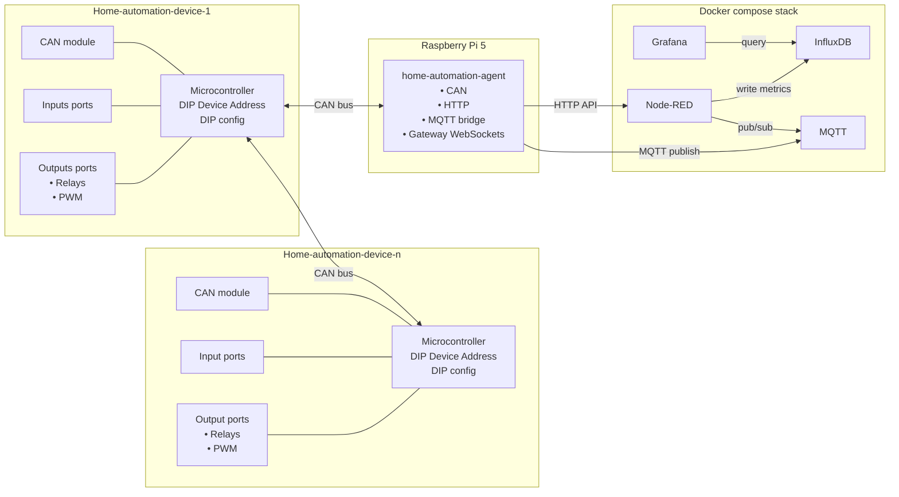

# Home Automation

System-level documentation and hardware artifacts for the home automation stack. This repo ties together the hardware design, Raspberry Pi setup, software stack, and links to the firmware, agent, and Node-RED nodes that make the system work.

## System architecture (high level)

Main module (STM32) + expansion modules on CAN bus -> Raspberry Pi (home-automation-agent) -> HTTP for control + MQTT for telemetry -> Node-RED flows -> InfluxDB/Grafana

## Architecture flowchart

## Related repositories

- `home-automation` (this repo): hardware files + Raspberry Pi setup + software compose
- [`home-automation-firmware`](https://github.com/nejcokorn/home-automation-firmware): STM32 firmware + CAN protocol
- [`home-automation-agent`](https://github.com/nejcokorn/home-automation-agent): NestJS CAN/HTTP/MQTT service for the Raspberry Pi
- [`home-automation-node-red`](https://github.com/nejcokorn/home-automation-node-red): Node-RED nodes that call the agent HTTP API

## Hardware

Main module PCB (r2.0):
- 24 VDC input (21.6-26.4 V), STM32F103RCT6 @ 3.3 V
- 16 opto-isolated digital inputs (software debounce)
- 12 digital outputs, 4 analog inputs
- DIP switch modes: 4 channel action selector
- Expansion headers for CAN module, relay output module

Other hardware:
- Relay module and CAN module folders (module-specific docs and outputs)
- 3D models for enclosure/PCB in `hardware/3d-models`

## Firmware (home-automation-firmware)

- CAN 2.0B extended identifiers (29-bit)
- ID layout: commandId [28:16], initiatorId [15:8], responderId [7:0]
- Reserved responder IDs: 0xF0..0xF8 for agent commands, 0xFF broadcast
- Commands: get/set port, delay, list delays, clear delays (by id or port)
- Config ops: debounce, doubleclick, actions, longpress, bypass, write EEPROM
- Errors returned as ACK+ERR with a data code (see firmware README)

## Agent service (home-automation-agent)

Runs on the Raspberry Pi, opens CAN interfaces matching `can*`, and exposes a REST API.

Defaults
- HTTP port: 3588 (override with `PORT`)
- MQTT: `mqtt://localhost:1883` unless `MQTT_URL` is set

HTTP endpoints (selection)
- `GET /can` -> list CAN interfaces + rx/tx counts
- `POST /can/:iface/tx` -> send raw CAN frame
- `GET /can/:iface/device` -> discover devices
- `GET /can/:iface/device/:deviceId/ping`
- `GET /can/:iface/device/:deviceId/config`
- `POST /can/:iface/device/:deviceId/config`
- `POST /can/:iface/device/:deviceId/eeprom`
- `GET /can/:iface/device/:deviceId/delay`
- `DELETE /can/:iface/device/:deviceId/delay/:delayId`
- `DELETE /can/:iface/device/:deviceId/delay/port/:port`
- `GET /can/:iface/device/:deviceId/:signalType/:direction/:portId`
- `POST /can/:iface/device/:deviceId/:signalType/:direction/:portId`

MQTT topics
- Publishes: `can/<iface>/device/<deviceId>/input/<port>` and `/output/<port>` for broadcast state changes
- Subscribes: `can/+/tx` to transmit raw CAN frames
- `agent/status` retained `online`/`offline`

## Node-RED nodes (home-automation-node-red)

Nodes wrap the agent HTTP API:
- `ha-agent` (config), `ha-discover`, `ha-ping`
- `ha-get-port`, `ha-set-port`
- `ha-list-delays`, `ha-delete-delay-id`, `ha-delete-delay-port`
- `ha-get-config`, `ha-set-config`, `ha-set-config-action`, `ha-save-eeprom`

## Software stack (this repo)

`docker-compose.yml` starts:
- Mosquitto MQTT (1883, 9001)
- Node-RED (1880)
- InfluxDB 2.7 (8086)
- Grafana (3000)

## Setup (high level)

1. Hardware: build the main module PCB and relay/CAN modules (see `hardware/`).
2. Firmware: flash the STM32 with `home-automation-firmware`.
   - Arduino IDE: add the STM32 board manager URL (see `home-automation-firmware/ArduinoIDE.md`).
3. Raspberry Pi: follow `rpi5.md` for OS setup, Docker, 1-Wire, and CAN.
4. CAN interfaces: create `can0`/`can1` systemd services (see `rpi5.md`).
5. Agent: install or run `home-automation-agent` and point MQTT to Mosquitto.
6. Node-RED: install the nodes from `home-automation-node-red` and configure `ha-agent` with the agent URL and CAN interface.

## Docs and artifacts

- Raspberry Pi setup: `rpi5.md`
- Hardware designs: `hardware/` (BOM, Gerbers, schematics, datasheets, 3D models)
- Software stack: `docker-compose.yml`

## Notes / gotchas

- The Node-RED `ha-agent` UI placeholder shows port 3200; the agent default is 3588, so set the correct URL.
